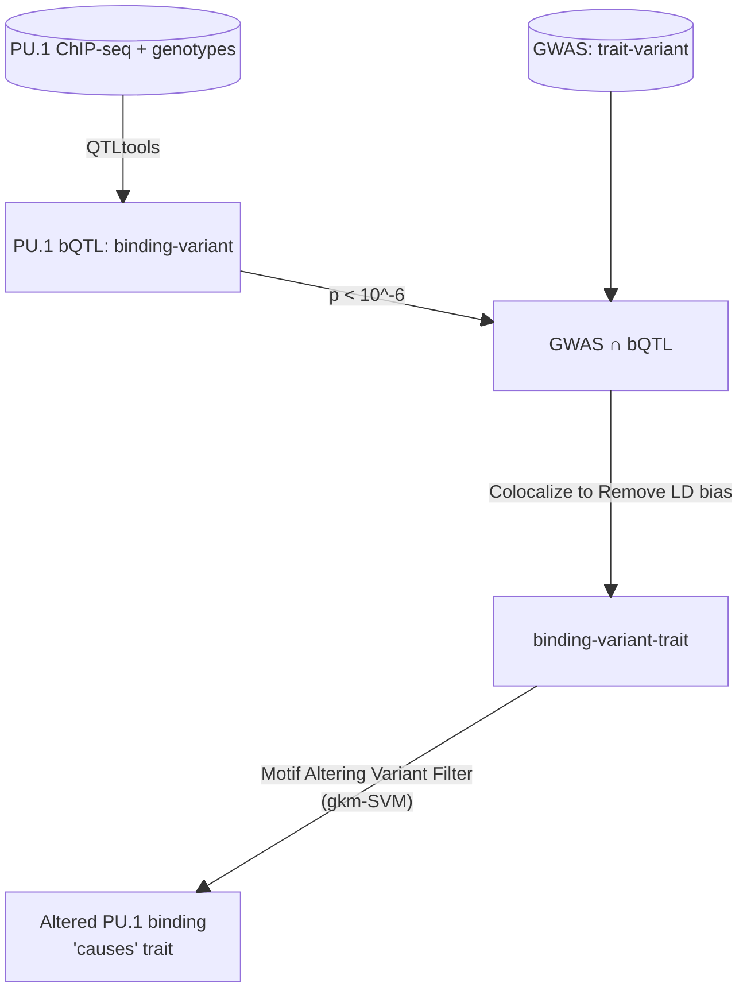

# What did they do?

---

```yaml
layout: image-left
image: /figures/abstract.jpg
imageBias: 0.8
text-class: center
```



<!--
The flowchart on the right shows their protocol. They are very careful not to explicity
say that they directly show a causual relationship, but claim that it is more likely for the selected variants to be casual.
-->

---

```yaml

```

# A little about PU.1

- A transcription factor important to myeloid and B-lymphoid cell development
- SPI1 is the gene name
- Part of the ETS family of transcription factors

---

```yaml
layout: image-right
image: /bQTL.jpg
```

# What is a bQTL?

<v-clicks>

- <u style="font-size: 1.5em">b</u>inding <u style="font-size: 1.5em">Q</u>uantitative <u style="font-size: 1.5em">T</u>rait <u style="font-size: 1.5em">L</u>ocus
- Assigns a genetic variant to a binding phenotype
- Requires genomic information and phenotype information
- [QTLtools](https://qtltools.github.io/qtltools/) applies a regression model to associate variants and phenotypes
  - Slope of regression is known as the "effect size"
  - returns a p value, slope, etc for variant association

</v-clicks>

---

```yaml
layout: image-left
image: /figures/1b.jpg
```

# What is a motif altering variant?

<v-clicks>

- A genetic variant responsible for changing the region that PU.1 normally
  binds to
- Specifically, binding should be significantly altered to be considered a
  "motif altering variant"
- gkm-SVM (gapped k-mer support vector machine) is a model trained to identify
  these motif altering variants

</v-clicks>

<v-drag-arrow v-click color="red" pos="516,165,-99,26"/>
<v-drag-arrow v-click color="blue" pos="490,406,-110,-83"/>

---

```yaml
layout: image-right
image: /figures/2b.jpg
```

# What is colocalization?

<v-clicks>

- An attempt to test the hypothesis that genetic signals are shared between a pair of traits (PU.1 binding and GWAS trait)
- Removes LD bias

</v-clicks>
